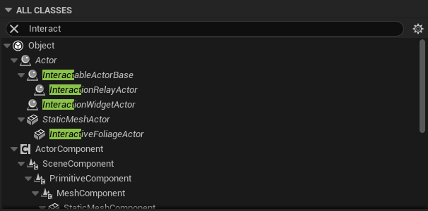

# 📦 Modular Interactions Plugin

A highly customizable interaction system built for Unreal Engine 5. This plugin provides developers with a modular, extensible foundation for adding interaction logic to actors, complete with dynamic widgets, reusable behavior types, and clean C++/Blueprint integration.

---

## 🔧 Features

- 🧩 Modular parent-class system with built-in interaction logic
- 🧠 Enum-driven behavior routing (`EActionType`, `EWidgetType`)
- 🎛 Dynamic details panel with conditional properties
- 💡 Supports both native and custom UMG widget prompts
- 🎮 Input mapping with Enhanced Input support
- 🧱 Reusable timeline-based actor movement/rotation
- 🔁 One-click setup with previewable widget actor in editor
- 💙 Fully Blueprint-compatible with override hooks for custom logic

---

## 🚀 Getting Started

### 1. Enable Plugin

Go to `Edit > Plugins` and enable the **Modular Interactions** plugin.

---

### 2. Add the Interaction Handler to Your Character

Add the `BP_InteractionHandlerComponent` to **your main character**.  
This component is required and handles most of the core interaction logic. It must be added directly to the player’s character so the plugin can consistently reference it during interaction.

Once the component is added, you're ready to begin setting up interactables:

- Use `AInteractableActorBase` to define objects that can be interacted with.
- Use `AInteractionRelayActor` to control one or more interactables remotely — great for switches, buttons, and other external triggers.

📌 *See the image below for a reference of available classes.*


---

### 3. Configure Interaction Settings

Each interactable actor includes a modular, dynamic details panel for setup:

- **Widget Type**: Choose from Tooltip, Icon Prompt, Radial Progress, or Custom.
- **Action Type**: Choose from Widget Action, Toggle Actor, Custom Event, and more.

🔄 The panel dynamically updates based on your selections:

- Enabling **Use Built-in Action** exposes pre-wired logic like widget toggling.
- Selecting different **Widget Types** reveals widget-specific options.
- Enabling **Use Animation** displays animation-specific settings.

This system keeps clutter to a minimum and only shows settings that are relevant to your current configuration.

---

### 4. Relay Interactable Actors (Optional)

Relay actors (`AInteractionRelayActor`) are designed to **remotely trigger other interactables**.  
These are ideal for buttons, control panels, switches, and similar use cases.

Relay-specific settings allow you to:

- Link multiple target actors
- Automatically follow or attach to another actor
- Control how it aligns and snaps in the world

📌 *See the image below for an example of relay actor configuration.*

---

### 5. Hook Up Inputs

Make sure your character has the correct input mappings via **Enhanced Input**.  
Alternatively, you can directly call `FinalInteract()` in custom input setups.

---


---

## 🧠 How It Works

The plugin routes all interaction logic through the parent class:
```cpp
// Called when player interacts with actor
void AInteractableActorBase::FinalInteract()
{
    PreInteract();
    OnInteract(); // Child classes can override this
}
